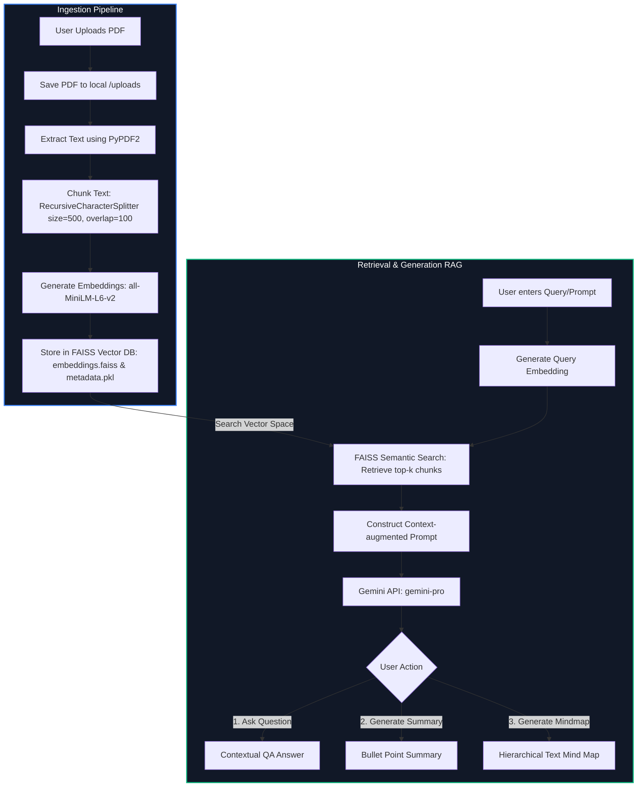

# 📚 Smart PDF Gemini RAG Notebook

[](https://www.python.org/)
[](https://streamlit.io/)
[](https://github.com/facebookresearch/faiss)
[](https://deepmind.google/technologies/gemini/)

An interactive Retrieval-Augmented Generation (RAG) notebook that allows users to upload a PDF, parse it, index its contents semantically into a local vector database, and perform context-aware questioning, summarization, and mind-map generation using the Google Gemini API.

---

## 📊 Technical Flow Diagram

The diagram below details the end-to-end workflow from PDF upload and ingestion to FAISS vector search and Gemini-powered generation:



---

## ⚡ Key Features

* **PDF Ingestion:** Automatic text extraction from PDF files using `PyPDF2`.
* **Semantic Chunking:** Custom splitting with overlap configured to keep context across chunk boundaries.
* **Local Vector Store:** Utilizes **FAISS** (Facebook AI Similarity Search) and `sentence-transformers` (`all-MiniLM-L6-v2`) to produce and index 384-dimensional vector embeddings locally.
* **Retrieval-Augmented Answering:** Queries the local vector store for context matches and appends them to prompts for ground truth generation.
* **Multi-Format AI Output:**
  - **QA:** Solves complex user questions based only on retrieved context.
  - **Summary:** Generates short, bulleted summaries of retrieved content.
  - **Mind-maps:** Automatically creates structured hierarchical text representations of the selected topic.

---

## 🛠️ Tech Stack

* **Frontend:** Streamlit
* **RAG Orchestrator:** LangChain
* **Vector Store:** FAISS (cpu)
* **Embedding Model:** SentenceTransformers (`all-MiniLM-L6-v2`)
* **Generative API:** Google Generative AI (Gemini Pro)
* **Document Parsing:** PyPDF2

---

## 🚀 Getting Started

Follow these steps to run the application locally:

### Step 1: Clone the Repository
```bash
git clone https://github.com/shaan774-lab/RAG_notebook.git
cd RAG_notebook
```

### Step 2: Set Up a Virtual Environment

**Using venv:**
```bash
python -m venv venv
# Windows:
venv\Scripts\activate
# macOS/Linux:
source venv/bin/activate
```

**Using Conda:**
```bash
conda create -n rag_env python=3.8 -y
conda activate rag_env
```

### Step 3: Install Dependencies
```bash
pip install -r requirements.txt
```

### Step 4: Configure API Keys
Create a `.env` file in the root directory and add your Google Gemini API Key:
```env
GEMINI_API_KEY=your_gemini_api_key_here
```

### Step 5: Start the Streamlit App
```bash
streamlit run app.py
```
Open your browser at `http://localhost:8501`.

---

## 📂 Project Structure

```text
RAG_notebook/
│
├── backend/
│   ├── vector_store/           # Directory where FAISS indices are saved
│   ├── geminiapi.py            # Interfaces with Google Generative AI API
│   └── rag_engine.py           # Embeddings, chunking, and FAISS indexing
│
├── uploads/                    # Local PDF uploads folder
├── app.py                      # Main Streamlit frontend interface
├── requirements.txt            # Python dependencies
└── .gitignore                  # Git exclusions (ignores vectors, env variables)
```

---

## 👥 Contributors

* **Shaan Saxena** - [shaan774-lab](https://github.com/shaan774-lab)
